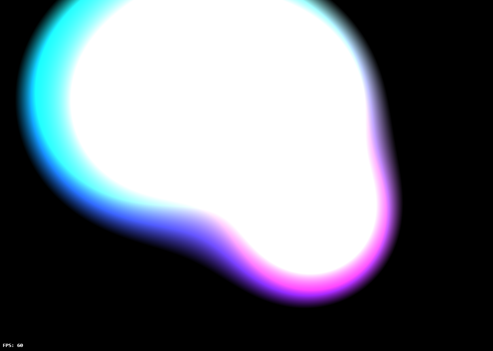

# JS Meta Balls visualizer

A [Meta ball](https://en.wikipedia.org/wiki/Metaballs) concept visualizer made entirely in JavaScript.
With GPU acceleration.

  
 

[Live demo here](https://leandrosq.github.io/js-metaballs/)

## A little bit about it

This is just a playground, I personally like to watch it in action, really cool effects.

Initially the project was created entirely using the [Web Canvas API](https://developer.mozilla.org/en-US/docs/Web/API/Canvas_API). However due to performance issues, even after using buffers aligned with image data for processing the Canvas's pixels, the project was converted to use the [WebGL API](https://developer.mozilla.org/en-US/docs/Web/API/WebGL_API), you can compare the two versions using the interface.

## Algorithm

For each and every pixel in the canvas, sum the radius over the distance from the pixel to the center of the meta ball for every meta ball in the scene.
Divide it by 255 and apply as the color for the pixel.

As meta balls approach each other, the color of the pixel will be more and more significant.

## Stack

| Name | Description |
| -- | -- |
| Babel / Babelify | For cross-browser compatibility, compiles JS into retro-compatible JS |
| Eslint | For linting and semantic analysis |
| Browserify | For bundling JS files |
| Sass | Superset of CSS |
| Gulp | For building tooling |
| Pure HTML5 Canvas API | For graphics |
| WebGL API | For GPU accelerated graphics |
| Github actions | For CI, building and deploying to github pages |

## Building sources

- `yarn install` to install dependencies
- `yarn build` to build sources
- `yarn start` to start the server
  - Or open the `index.html` file at `/dist/index.html`

For dev environment, you can use `gulp dev` to run the server and live reload on changes.
